<!--
  HOW TO USE
  1. Create a repo named EXACTLY like your GitHub username (public).
  2. Put this README.md in the root and tva-banner.svg in /assets.
  3. Replace everything in [BRACKETS] and every Wolfraze.
  4. Open each assets/*.svg in a text editor to change its [placeholders]
     (ticker.svg, tempad.svg, timeline.svg, bug-hunt.svg).
-->

<div align="center">





<a href="https://git.io/typing-svg">

</a>


</div>


## 🗂️ VARIANT CASE FILE &nbsp;`№ [0001]`

> *Filed by the Time Variance Authority. Unauthorized reading of this file is a pruning offense.*

| | |
|---|---|
| **VARIANT** | Siddharth Patil |
| **ALIAS** | @Wolfraze |
| **ORIGIN TIMELINE** | Navi Mumbai, Maharashtra |
| **OCCUPATION** | B.E. E&TC @ SIES Graduate School of Technology |
| **NEXUS EVENT** | The day I started building interactive projects in 2024 |
| **KNOWN WEAPONS** | Next.js · React · JavaScript |
| **LAST SEEN** | IEEE events · Marvel-themed builds · 3 AM debugging |


## 🕰️ MISS MINUTES SAYS…

<table>
<tr>
<td width="110" align="center">🟠<br><b>Miss<br>Minutes</b></td>
<td>

*"Hi there! Thanks for visiting this variant's file! Please keep your hands, feet and pull requests inside the Time-Door at all times. Remember: being pruned is not a bug, it's a feature!"* 🥰

</td>
</tr>
</table>


## 🕵️ INTERROGATION ROOM &nbsp;*(Mobius M. Mobius presiding)*

> **MOBIUS:** *Sits down, grabs a snack.* Alright. Let's talk about you.

**MOBIUS:** Who are you?
**VARIANT:** I am a B.E. E&TC student who enjoys turning ideas into functional web experiences, games, and UI-driven builds.

**MOBIUS:** What do you build?
**VARIANT:** Websites and games for IEEE events: a Marvel-themed Next.js fest site and a Family Feud game with a buzzer.

**MOBIUS:** Why do you do it?
**VARIANT:** I like seeing an idea become real, then improving it until it feels smooth and useful.

**MOBIUS:** Hobbies outside the screen?
**VARIANT:** Gaming, music, and a little competitive chaos after a build finally works. 🏍️

> **MOBIUS:** *Closes the file.* Honestly? I like this one.


## ⚖️ CHARGES FILED AGAINST THE VARIANT

| № | OFFENSE | SEVERITY |
|:-:|---|:-:|
| 1 | Committing straight to `main` without a Time Keeper's approval | 🔴 |
| 2 | Naming event slugs after Marvel heroes (Squabble → `doom`, Inquisitive → `blackpanther`) | 🟠 |
| 3 | Fixing one registration button and creating three new timelines | 🔴 |
| 4 | Deploying at 3 AM with full confidence | 🔴 |
| 5 | Building a strike buzzer that was "too low, too short, and not a horn" | 🟠 |
| 6 | Hosting a Family Feud and still losing the argument over the answers | 🟡 |
| 7 | Saying "it works on my machine" to a Judge | 🔴 |

> **JUDGE RENSLAYER:** *You were built to serve a purpose. Free will, however, appears to have compiled successfully.*


## 🏹 HUNTER B-15'S BUG REPORT

<div align="center"></div>


## 🧰 VARIANT ARSENAL

**Primary Weapons**


**Defensive Tools**


**Under Temporal Training** *(the Loom is still weaving these)*


| TVA RANK | MEANING | MY STACK |
|---|---|---|
| 🟤 **Minuteman** | Just learning the paperwork | Digital Communication, Data Analytics |
| 🟠 **Hunter** | Can chase bugs across timelines | Next.js, React |
| 🟢 **Judge** | Reviews other people's chaos | Git, GitHub |
| 👑 **Time Keeper** | Theoretical, nobody has seen one | — |


## 📼 EXHIBITS

| EXHIBIT | CLASSIFIED DESCRIPTION | TECH | EVIDENCE |
|:-:|---|---|:-:|
| **A** | **Techopedia 15**: Marvel-themed IEEE fest website with four events: Squabble (Debate), Inquisitive (Quiz), Eureka (PPT), Vanguard (IR Laser Tag). | Next.js | [Repo](https://github.com/Wolfraze/techopedia-15) |
| **B** | **Multiverse Kart**: a complete game-development project with the full gameplay loop, world feel, and implementation. | Next.js • React • JavaScript | [Repo](https://github.com/Wolfraze/Multiverse-kart) |
| **C** | **LoRa Disaster Communication Network**: SIH project focused on resilient emergency communication and networking. | LoRa • Embedded Systems | [Repo](https://github.com/Wolfraze) |


## 🌌 THE SACRED TIMELINE vs. MY BRANCHES

<div align="center"></div>


## 🔧 OB'S REPAIR BAY &nbsp;*(Ouroboros fixing the TemPad)*

> **OB:** *Adjusts glasses, taps the TemPad.* Right. Let's see what we've got.

<div align="center"></div>


## 🎯 CURRENT MISSION BRIEFING

```text
CLASSIFICATION: ORANGE PAPER
─────────────────────────────
OBJECTIVE ........ Shipping IEEE event projects
LEARNING ......... Digital Communication, Data Analytics
SEEKING .......... collaborators for web builds and internships in full-stack / product-focused work
ASK ME ABOUT ..... Next.js, event websites, game logic
```


## 📜 TVA REGULATIONS FOR COLLABORATING WITH THIS VARIANT

1. **Open an issue before a pull request.** Unfiled paperwork will be pruned.
2. **Do not touch the Sacred `main` branch.** Branches exist for a reason.
3. **Write meaningful commit messages.** "fixed stuff" is a Nexus Event.
4. **Be kind in code review.** Even Loki learned to.
5. **Free will is allowed,** but please run the tests first.


## 🌀 THE VOID &nbsp;*(where deprecated code goes)*

> **ALIOTH:** *devours `old-project-v1`, `test2`, and `Untitled-7`*

Every abandoned repo ends up here. Some of them were good. We don't talk about them.


## 📊 TIMELINE ACTIVITY REPORT

<div align="center">


</div>


## 🔒 REDACTED DOCUMENTS

> **FACT 01:** This variant once spent ████ hours fixing a registration button that turned out to be a slug ██████████.
> **FACT 02:** The first Family Feud buzzer was ruled "not enough of a horn" by the ██████ Committee.
> **FACT 03:** [Your real fun fact with some words replaced by ██████.]


## 📡 CONTACT THE TIME KEEPERS

<div align="center">

[](https://linkedin.com/in/siddharth-patil-763635426/)
[](mailto:YOU@example.com)
[](https://instagram.com/Wolfraze)

</div>


<div align="center">

### 🟠 A MESSAGE FROM HE WHO REMAINS

*"Whoops. All done. Go on, branch the timeline, fork the repo.*
*Just remember to star it on your way out."* ⭐

<br>

<a href="#"></a>


**⏳ ALL TIME IS SACRED ⏳**


</div>

