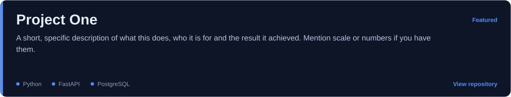
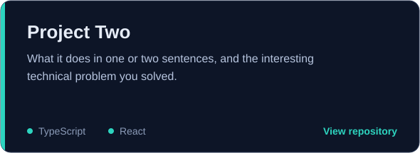
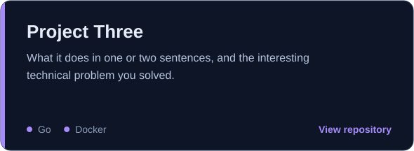
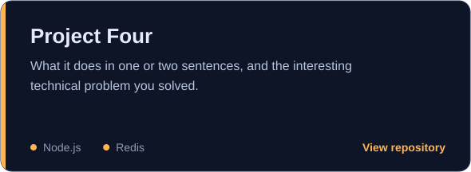
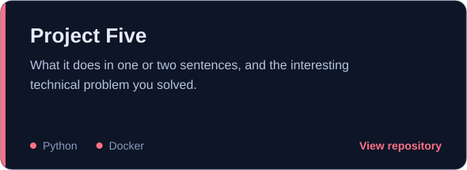

   

## About

I'm a software engineer focused on backend systems, APIs and developer tooling. I care about code that is easy to read, easy to test and easy to delete.

Most of my work sits between product and infrastructure: turning a vague requirement into a service that stays up under load.

| | |
|:--|:--|
| **Role** | Software Engineer |
| **Based in** | City, Country |
| **Focus** | Backend systems, APIs, developer tooling |
| **Open to** | Full-time roles, freelance, open source |

## Tech stack

| | |
|:--|:--|
| **Languages** |     |
| **Frontend** |    |
| **Backend and data** |    |
| **Infrastructure** |     |

## Featured projects

<table width="100%">
<tr>
<td width="50%"></td>
<td width="50%"></td>
</tr>
<tr>
<td width="50%"></td>
<td width="50%"></td>
</tr>
</table>

More on my [GitHub profile](https://github.com/your-github-username?tab=repositories).

## Experience

| Period | Role | Highlights |
|:--|:--|:--|
| 2024 - Present | **Software Engineer**, Company Name | Own the payments API. Cut p95 latency by 40% and moved deploys to zero-downtime. |
| 2022 - 2024 | **Junior Developer**, Company Name | Built internal tooling used by 200+ staff. Introduced automated testing and CI. |
| 2018 - 2022 | **B.Tech, Computer Science**, University Name | Graduated with honours. Led the campus coding club. |

## Currently

- **Building:** The next thing on your list
- **Learning:** Distributed systems and Rust
- **Ask me about:** APIs, databases, developer experience

## GitHub activity

## Get in touch

   

